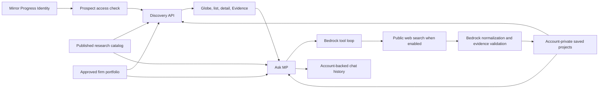

# Prospect architecture and data contracts

## Runtime boundary

The deployed application is a Next.js Pages Router service in the private `identity-release/client` checkout. The public URL is `/prospect`; legacy `/apps/studioiq` paths are routed or redirected for compatibility. The API and many file names retain `studioiq` from the former product name. That is an implementation detail, not current product copy. Mirror Progress Identity provides authentication; Prospect API routes call `requireStudioIqProductAccess` before reading account or organization data.

This public directory stores selected release files as `.txt` snapshots. They are **not** imported by the obsolete root `client/` application. An agent working on the actual release should edit `identity-release/client` and refresh these snapshots afterward. The release checkout, database, assets, IAM configuration, and secrets are required to run production; this source record alone is insufficient.

## Data flow

### Published Discovery

The [discovery API](client/pages/api/products/studioiq/discovery.ts.txt) loads account-visible published intelligence, applies the freshness policy, joins collaboration and approved portfolio precedents, and projects records for the UI. It then adds account-private web projects as a **separate discovery class**. Portfolio matching only runs against approved or verified firm precedents. A missing match yields no fit context; it is not a zero-quality verdict on a firm's work.

The [main terminal](client/components/studioiq/StudioIqTerminal.tsx.txt) owns layout and responsive chat state. [Discovery](client/components/studioiq/StudioIqDiscovery.tsx.txt) renders the globe/list and project detail. Source links enter Evidence, while the assistant can send a validated focus event to the same project view.

### Three project record classes

| Class | Owner and authority | How it enters | Where it appears |
| --- | --- | --- | --- |
| Published opportunity | Mirror Progress research, scoped to entitled customer | Research publication pipeline | Shared Discovery catalog for allowed customers |
| Private saved web project | Individual Prospect account, unverified | Assistant web result → normalization → private upsert | That account's My saved view and assistant catalog |
| Firm portfolio precedent | Customer organization, with approval state | File import → extraction → human review/approval | Practice-fit context and firm portfolio |

The [private project model](client/lib/prospect-private-projects.ts.txt) uses a stable account-plus-canonical-URL ID to deduplicate saves. It stores a clean title, optional location/type/stage/buyer/deadline fields, source URL, capture evidence, and normalization version. Bedrock proposes fields through [project normalization](client/lib/prospect-agent/project-normalization.ts.txt); the server requires supporting source quotes and rejects an address-contaminated or unsupported title. Invalid optional values become empty. Dates are kept only when an explicit quoted closing date validates. Older saves with a legacy normalization version are repaired in bounded batches on owner reads; the original ID and save timestamp remain stable. A failed repair is recorded so an unfixable snippet does not repeatedly invoke the model.

The [portfolio import service](client/lib/studioiq-portfolio-import.ts.txt) is a different path. Uploaded files produce draft precedents, and authorized humans approve them before they are eligible for matching. Do not treat a private web save as an approved portfolio precedent.

### Ask MP and chat continuity

The [agent runner](client/lib/prospect-agent/run.ts.txt) defines the Bedrock tool set and continuation loop: list/search/get/compare projects, focus one project, inspect market data, use guide scenes, and optionally search the web, preview or save a result, and read selected source evidence. Tool inputs are validated against account-visible data and active workflow IDs. The [agent API](client/pages/api/products/studioiq/agent.ts.txt) checks access, applies a per-account daily web-search quota, persists the user's turn before streaming, and saves the completed answer to the account-backed chat session. Closing the visual panel does not intentionally discard the answer. The [chat API](client/pages/api/products/studioiq/chats.ts.txt) supports history retrieval. Local preview history is browser-local and should not be confused with production persistence.

The [walkthrough registry](client/lib/studioiq-walkthrough.ts.txt) versions active scenes. [ProspectWalkthrough](client/components/studioiq/ProspectWalkthrough.tsx.txt) measures a live DOM anchor and animates the spotlight. A step unavailable for that account or viewport is omitted or skipped. The portfolio step is only available when the user can manage that firm's portfolio.

### Market Pulse and source evidence

The market service exposes normalized values with publisher, geography, observation period, and retrieval metadata. The ticker is context, not a project feed. A ticker click opens a formatted detail panel; the raw provider dataset is a secondary source link. The Source workspace keeps provenance visible and scopes assistant source reading to the selected project/evidence pair.

## Invariants for new work

- Keep authorization at the API boundary and the account/organization filter at the database query boundary.
- Preserve stable IDs and provenance when a record is re-normalized.
- Never silently promote a private save or imported draft to the published catalog.
- Never infer deadlines from publication/retrieval dates or precise coordinates from country markers.
- Keep inactive walkthrough scenes out of the tool contract.
- Do not put environment values, customer files, database exports, or raw production logs into this public source record.
